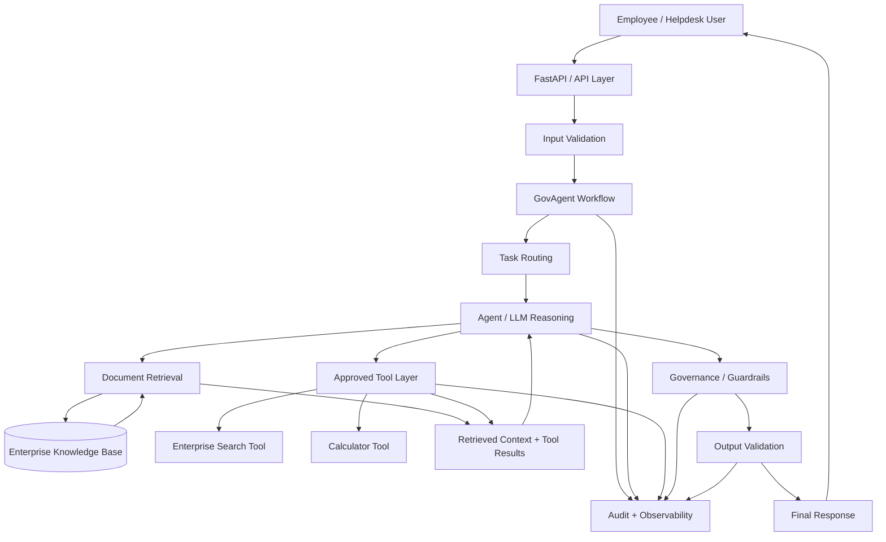

# GovAgent — Architecture Design

## 1. Architecture Goal

GovAgent uses a governed agentic architecture in which deterministic application code, controlled workflows, and agent-based reasoning have separate responsibilities.

The architecture is designed to keep important enterprise operations controlled while allowing the LLM/agent to make decisions where reasoning is useful.

## 2. High-Level Data Flow



## 3. Architecture Blocks

| Block                     | Classification        | Responsibility                                  | Justification                                               |
| ------------------------- | --------------------- | ----------------------------------------------- | ----------------------------------------------------------- |
| Employee / Helpdesk User  | External              | Sends requests                                  | Human interaction                                           |
| FastAPI / API Layer       | Plain Code            | HTTP/API handling                               | Deterministic application logic                             |
| Input Validation          | Plain Code            | Validate incoming requests                      | Validation should be deterministic                          |
| GovAgent Workflow         | Workflow              | Controls execution sequence                     | Provides explicit control over agent execution              |
| Task Routing              | Workflow              | Determines available execution path             | Routing rules should remain controlled                      |
| Agent / LLM Reasoning     | Agent                 | Understands requests and decides actions        | Requires language reasoning and tool selection              |
| Document Retrieval        | Plain Code            | Searches knowledge base                         | Retrieval is infrastructure and should be predictable       |
| Enterprise Knowledge Base | Plain Code / Data     | Stores enterprise information                   | Data storage does not require agent reasoning               |
| Approved Tool Layer       | Plain Code            | Provides controlled capabilities                | Tool implementations should be deterministic                |
| Enterprise Search Tool    | Plain Code            | Searches approved enterprise information        | Controlled external/data operation                          |
| Calculator Tool           | Plain Code            | Performs calculations                           | Deterministic operation                                     |
| Context Assembly          | Plain Code            | Combines retrieved information and tool results | Controlled data transformation                              |
| Governance / Guardrails   | Workflow + Plain Code | Enforces system rules                           | Critical safety decisions should not depend only on the LLM |
| Output Validation         | Plain Code            | Checks generated output                         | Deterministic validation                                    |
| Final Response            | Plain Code            | Returns response to user                        | API/application responsibility                              |
| Audit + Observability     | Plain Code            | Records execution information                   | Logging and metrics should be deterministic                 |

## 4. Why This Separation Matters

GovAgent should not make every part of the application an autonomous agent.

### Plain Code

Use plain code when the operation has a predictable rule.

Examples:

* Validate JSON
* Check authorization
* Search a database
* Calculate a value
* Store logs
* Measure latency
* Count tokens

### Workflow

Use a workflow when the execution path should be explicitly controlled.

Examples:

* Validate input → retrieve → generate → validate output
* Decide whether tool use is permitted
* Require approval before a sensitive action
* Route different request types

### Agent

Use an agent when the system needs reasoning to determine what should happen next.

Examples:

* Understand an ambiguous natural-language request
* Decide whether document retrieval is necessary
* Select an appropriate approved tool
* Determine whether additional information is required

## 5. Example Execution

A policy question could follow:

```text
User
 ↓
API
 ↓
Input Validation
 ↓
GovAgent Workflow
 ↓
Agent
 ↓
Document Retrieval
 ↓
Enterprise Knowledge Base
 ↓
Relevant Context
 ↓
Agent / LLM
 ↓
Governance
 ↓
Output Validation
 ↓
Response
```

A tool-based request could follow:

```text
User
 ↓
Input Validation
 ↓
Workflow
 ↓
Agent
 ↓
Tool Selection
 ↓
Authorization Check
 ↓
Approved Tool
 ↓
Tool Result
 ↓
Agent
 ↓
Output Validation
 ↓
Response
```

## 6. Governance Principle

The LLM should not have unrestricted control over enterprise systems.

Tools should be:

* Explicitly registered
* Validated
* Authorized
* Logged
* Executed through controlled application code

This allows the agent to make decisions while keeping consequential operations under deterministic system control.
