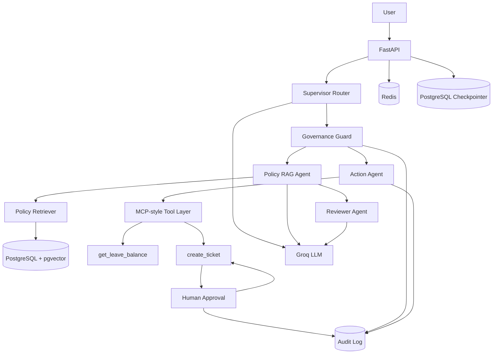
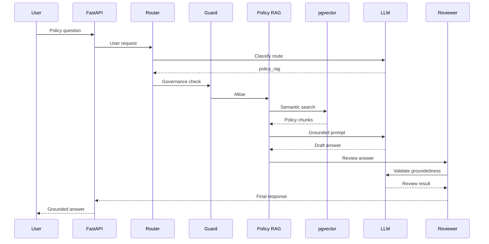
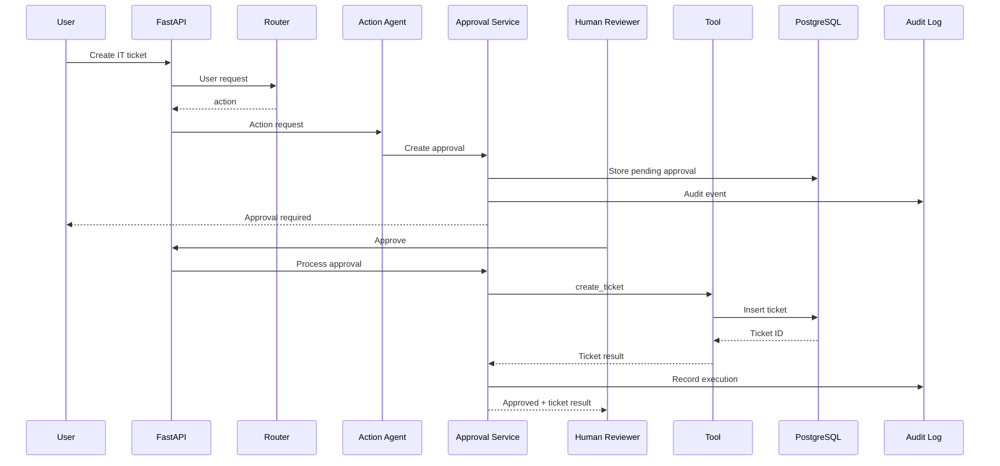

# GovAgent Architecture

## 1. Overview

GovAgent is a governed enterprise AI assistant composed of a FastAPI service, LangGraph supervisor workflow, policy RAG pipeline, action tools, human approval mechanism, reviewer agent, governance layer, persistent memory, and observability components.

The architecture separates deterministic application logic from LLM-driven reasoning and controlled tool execution.

---

## 2. High-Level Architecture



---

## 3. Component Classification

### Plain Code

Deterministic application components:

* FastAPI API layer
* Database access
* Redis memory
* Audit logging
* Approval persistence
* Budget calculation
* Governance checks
* Configuration
* Validation

### Workflow

LangGraph orchestration components:

* Supervisor/router
* Governance guard
* Policy RAG path
* Action path
* Reviewer path
* Checkpoint persistence

### Agent

LLM-driven specialists:

* Router agent
* Policy RAG agent
* Action agent
* Reviewer agent

---

## 4. Request Lifecycle

### Policy Request



---

## 5. Action Lifecycle



---

## 6. Governance

Governance controls are applied before controlled execution.

### Prompt Injection

```text
User/document content
        ↓
Injection detection
        ↓
Blocked / Allowed
```

### Budget

The system tracks:

* Prompt tokens
* Completion tokens
* Estimated cost

Configured limits:

```text
MAX_REQUEST_TOKENS = 8000
MAX_REQUEST_COST_USD = 0.01
```

### Approval

Write operations require human approval.

```text
Read
 └── Can proceed through normal workflow

Write
 └── Approval required
       ├── Approved → Execute
       └── Rejected → Stop
```

---

## 7. Data Stores

### PostgreSQL

Used for:

* Employees
* Leave balances
* Helpdesk tickets
* Approvals
* Audit logs
* LangGraph checkpoints
* Policy vectors

### pgvector

Used for semantic policy retrieval.

### Redis

Used for session-level memory.

---

## 8. Observability

Tracing spans include:

```text
llm.router
retrieval.search
llm.policy_rag
llm.reviewer
tool.get_leave_balance
tool.create_ticket
```

Each span records:

* Span ID
* Component
* Start timestamp
* Finish timestamp
* Duration
* Status
* Metadata

LLM usage records:

```text
prompt_tokens
completion_tokens
total_tokens
estimated_cost_usd
```

---

## 9. Failure Modes

The architecture explicitly tests:

### Prompt Injection

Malicious instructions embedded in user input or retrieved documents are detected.

### Budget Exhaustion

Requests exceeding token or cost limits are blocked.

### Tool Timeout

Slow tool execution is detected through timeout testing.

### Approval Replay

A previously decided approval cannot be approved or rejected again.

### Tool Failure

Tool execution errors are recorded through audit logging and tracing.

---

## 10. Security Principles

GovAgent follows these principles:

1. Retrieved documents are treated as untrusted content.
2. LLM output does not automatically authorize enterprise writes.
3. Write operations require human approval.
4. Important operations are auditable.
5. Token and cost budgets are monitored.
6. Tool failures are captured.
7. Reviewer validation is performed for policy responses.

---

## 11. Architecture Decision

The project uses LangGraph because the workflow contains explicit state transitions and governance checkpoints.

The architecture deliberately separates:

```text
LLM reasoning
      ↓
Workflow control
      ↓
Tool execution
      ↓
Human approval
      ↓
Persistent side effect
```

This provides clearer control boundaries than allowing an unrestricted agent to execute enterprise actions directly.

---

## 12. Production Extensions

Future production architecture could add:

* OAuth/OIDC
* RBAC
* Enterprise identity
* Full MCP deployment
* OpenTelemetry
* Prometheus/Grafana
* CI/CD evaluation gates
* Secret management
* Policy-as-code
* Distributed execution
* Stronger content safety controls
